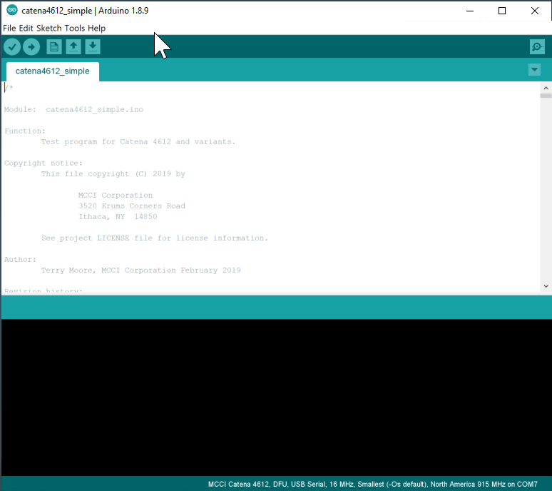

# catena4802_simple

<!-- TOC depthFrom:2 updateOnSave:true -->

- [Introduction](#introduction)
- [Getting Started](#getting-started)
	- [Clone this repository into a suitable directory on your system](#clone-this-repository-into-a-suitable-directory-on-your-system)
	- [Install the MCCI STM32 board support library](#install-the-mcci-stm32-board-support-library)
	- [Select your desired band](#select-your-desired-band)
	- [Select the Serial interface](#select-the-serial-interface)
	- [Installing the required libraries](#installing-the-required-libraries)
		- [List of required libraries](#list-of-required-libraries)
	- [Configure Modbus parameters](#configure-modbus-parameters)
	- [Build and Download](#build-and-download)
	- [Load the sketch into the Catena](#load-the-sketch-into-the-catena)
- [Provision your Catena 4802](#provision-your-catena-4802)
- [Notes](#notes)
	- [Downloading images](#downloading-images)
		- [Setting up ST-Link connection](#setting-up-st-link-connection)
	- [Data Format](#data-format)

<!-- /TOC -->
## Introduction

This sketch demonstrates the MCCI Catena&reg; 4802 as a remote temperature/humidity/light sensor using a LoRaWAN&reg;-techology network to transmit to a remote server.

The Catena 4802 is a LoRaWAN-enabled sensor device with the following sensors:

- Sensirion SHT-31-DIS-F temperature and humidity sensor on an Adafruit breakout board
- Modbus-capable RS485 interface.
- I2C Level shifter

Documents on the MCCI Catena 4802 are at https://github.com/mcci-catena/HW-Designs/tree/master/Boards/Catena-4802.

## Getting Started

In order to use this code, you must do several things:

1. Clone this repository into a suitable directory on your system.
2. Install the MCCI Arduino board support package (BSP).
3. Install the required Arduino libraries using `git`.
4. Build the sketch and download to your Catena 4802.

After you have loaded the firmware, you have to set up the Catena 4802.

This sketch uses the Catena-Arduino-Platform library to store critical information on the integrated FRAM. There are several kinds of information. Some things only have to be programmed once in the life of the board; other things must be programmed whenever you change network connections. Entering this information this involves entering USB commands via the Arduino serial monitor.

- We call information about the  4802 that (theoretically) never changes "identity".
- We call information about the LoRaWAN "provisioning".

### Clone this repository into a suitable directory on your system

This is best done from a command line. You can use a number of techniques, but since you'll need a working git shell, we recommend using the command line.

On Windows, we strongly recommend use of "git bash", available from [git-scm.org](https://git-scm.com/download/win). Then use the "git bash" command line system that's installed by the download.

The goal of this process is to create a directory called `{somewhere}/Catena-Sketches`. You get to choose `{somewhere}`. Everyone has their own convention; the author typically has a directory in his home directory called `sandbox`, and then puts projects there.

Once you have a suitable command line open, you can enter the following commands. In the following, change `{somewhere}` to the directory path where you want to put `catena4802_simple`.

```console
$ cd {somewhere}
$ git clone https://github.com/mcci-catena/catena4802_simple
Cloning into 'catena4802_simple'...
...

$ # get to the right subdirectory
$ cd catena4802_simple

$ # confirm that you're in the right place.
$ ls
catena4802_simple.ino  git-repos.dat  README.md
```

### Install the MCCI STM32 board support library

Open the Arduino IDE. Go to `File>Preferences>Settings`. Add `https://github.com/mcci-catena/arduino-boards/raw/master/BoardManagerFiles/package_mcci_index.json` to the list in `Additional Boards Manager URLs`.

If you already have entries in that list, use a comma (`,`) to separate the entry you're adding from the entries that are already there.

Next, open the board manager. `Tools>Board:...`, and get up to the top of the menu that pops out -- it will give you a list of boards. Search for `MCCI` in the search box and select `MCCI Catena STM32 Boards`. An `[Install]` button will appear to the right; click it.

Then go to `Tools>Board:...` and scroll to the bottom. You should see `MCCI Catena 2`; select that.  From the IDE's point of view, the Catena 4802 and the Catena 4802 are identical.

### Select your desired band

When you select a board, the default LoRaWAN region is set to US-915, which is used in North America and much of South America. If you're elsewhere, you need to select your target region. You can do it in the IDE:



As the animation shows, use `Tools>LoRaWAN Region...` and choose the appropriate entry from the menu.

### Select the Serial interface

When you select a board, the default Serial interface is set to `Generic serial`, which only uses first hardware serial of Catena 4802. The RS-485 module in Catena uses the second hardware serial for modbus(RTU) communication. As this sketch uses RS-485 communication, it is necessary to select `Two HW Serial` in Serial interface.

### Installing the required libraries

This sketch uses several sensor libraries.

The script [`git-boot.sh`](./git-boot.sh) in the top directory of this repo will get all the things you need.

It's easy to run, provided you're on Windows, macOS, or Linux, and provided you have `git` installed. We tested on Windows with git bash from https://git-scm.org, on macOS 10.11.3 with the git and bash shipped by Apple, and on Ubuntu 16.0.4 LTS (64-bit) with the built-in bash and git from `apt-get install git`.

You can make sure your library directory is populated using `git-boot.sh`.

```console
$ cd catena4802_simple
$ ./git-boot.sh
Cloning into 'Catena-Arduino-Platform'...
remote: Counting objects: 1201, done.
remote: Compressing objects: 100% (36/36), done.
remote: Total 1201 (delta 27), reused 24 (delta 14), pack-reused 1151
Receiving objects: 100% (1201/1201), 275.99 KiB | 0 bytes/s, done.
Resolving deltas: 100% (900/900), done.
...

==== Summary =====
No repos with errors
No repos skipped.
*** no repos were pulled ***
Repos downloaded:      Catena-Arduino-Platform arduino-lorawan Catena-mcciadk arduino-lmic MCCI_FRAM_I2C MCCI-Catena-HS300x
```

It has a number of advanced options; use `./git-boot.sh -h` to get help, or look at the source code [here](./git-boot.sh).

**Beware of Catena-Sketches issue #18**.  If you happen to already have libraries installed with the same names as any of the libraries in `git-repos.dat`, `git-boot.sh` will silently use the versions of the library that you already have installed. (We hope to soon fix this to at least tell you that you have a problem.)

#### List of required libraries

This sketch depends on the following libraries.

* https://github.com/mcci-catena/Adafruit_FRAM_I2C
* https://github.com/mcci-catena/Catena-Arduino-Platform
* https://github.com/mcci-catena/arduino-lorawan
* https://github.com/mcci-catena/Catena-mcciadk
* https://github.com/mcci-catena/arduino-lmic
* https://github.com/mcci-catena/Modbus-for-Arduino
* https://github.com/mcci-catena/MCCI-Catena-SHT3x

### Configure Modbus parameters

To communicate with the Modbus slave, it is necessary to modify the Modbus slave parameter in the `setup_modbus` function as it matches the device parameters. For example:

```
/* Modbus slave parameters */
u8addr = 65;			// current target device: 65
u8fct = 03;			// Function code
u16RegAdd = 00;			// start address in device
u16CoilsNo = 13;		// number of elements (coils or registers) to read
host.begin(&mySerial, 9600);	// baud-rate at 9600
```

Connect your modbus slaves A and B terminal to Catena 4802s A and B terminal (JP3).

### Build and Download

Shutdown the Arduino IDE and restart it, just in case.

If you haven't already, use File>Open to load the `catena4802_simple.ino` sketch.

Ensure selected board is 'MCCI Catena 4802' (in the GUI, check that `Tools`>`Board "..."` says `"MCCI Catena 4802"`.

Make sure the Serial Interface is set to "Two HW Serial". For initial testing, we recommend setting the system clock to 16 MHz.  Make sure your target network is selected.

Follow normal Arduino IDE procedures to build the sketch: `Sketch`>`Verify/Compile`. If there are no errors, go to the next step.

### Load the sketch into the Catena

Make sure the correct port is selected in `Tools`>`Port`.

Load the sketch into the Catena using `Sketch`>`Upload` and move on to provisioning.

## Provision your Catena 4802

In order to provision the Catena, refer the following document: [How-To-Provision-Your-Catena-Device](https://github.com/mcci-catena/Catena-Sketches/blob/master/extra/How-To-Provision-Your-Catena-Device.md).

## Notes 

#### Setting up ST-Link connection

Catena 4802 uses ST-Link V2 programmer for programming the firmware. Below is the connection between 4802 and ST-Link programmer


Catena 4802 (JP1) | ST-Link
----------------- | -------
+VDD | Pin 1
GND | Pin 3
SWCLK | Pin 9
SWDIO | Pin 7
nRST | Pin 15

### Data Format

Refer to the [Protocol Description](extra/catena-message-port4-format.md) in the `extras` directory for information on how data is encoded.
